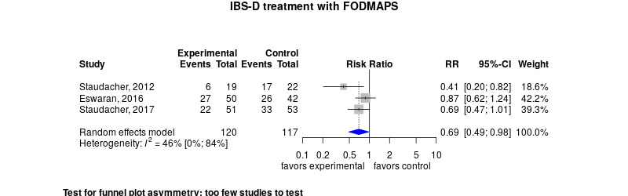

Irritable bowel treatment with FODMAP
============================================
A living systematic review

**Clinical summary:** This meta-analysis suggests that clinical intervention *is* effective for patients with IBS-D. Heterogeneity of results as measured by I2 was '[moderate](http://handbook-5-1.cochrane.org/chapter_9/9_5_2_identifying_and_measuring_heterogeneity.htm)' at 46%. This review updates previously published meta-analysis(es).(citation[s] below)

Meta-regression of common modulators (year of publication, study size, event rate in the control groups) finds that the outcome of the intervention is effected by xx.
* [Reconciliation of conclusions with prior meta-analyses](files/reconciliation-tables/Reconciliation%20of%20conclusions.pdf) (under construction)
* [Keep current with this topic](files/searching/Keep-up.md) (under construction)

Acknowledgement: we acknowledge the essential work by the authors of the prior [systematic review(s)](#systematic-reviews) listed below.

**Methods overview:** This repository is an [openMetaAnalysis](https://openmetaanalysis.github.io/) that combines methods of scoping, rapid, and living systematic reviews.  This analysis updates one or more previously published review(s) below. A comparison of studies included in this review compared to prior reviews are in the table, [reconciliation of trials included with prior meta-analyses/](files/reconciliation-tables/Reconciliation%20of%20studies.pdf). Newer studies included are listed in the references below. Rationale for newer trials excluded may be listed at the end of the references. 
* [Methods](http://openmetaanalysis.github.io/methods.html) for openMetaAnalysis
* [Evidence search](files/searching/evidence-search.md) for this review (under construction)

**Results:** Details of the studies included are in the:
* [Reconciliation of trials included with prior meta-analyses/](files/reconciliation-tables/Reconciliation%20of%20studies.pdf) (under construction)
* [Description of studies (PICO table)](files/study-details/table-pico.pdf) (under construction)
* [Risk of bias assessment](files/study-details/table-bias.pdf) (under construction)
* [Forest plots](../master/files/forest-plots) ([source data](files/data))
* [Network plots](../master/files/network) (optional)
* [Reconciliation of conclusions with prior meta-analyses](files/reconciliation-tables/Reconciliation%20of%20conclusions.pdf) (under construction)

The forest plot for the primary outcomes are below. Additional [forest plots](files/forest-plots) of secondary analyses may be available. 

<!--
The meta-regression for the primary outcomes are below. Additional [meta-regressions](files/metaregression) of secondary analyses may be available. 

The GRADE Profile is below. 
-->

References:
----------------------------------

### Systematic review(s)
#### Most recent review at time of last revision of this repository

### Randomized controlled trials
#### New trial(s) *not* included in the most recent review above
1. Böhn L, Störsrud S, Liljebo T, Collin L, Lindfors P, Törnblom H, Simrén M. Diet low in FODMAPs reduces symptoms of irritable bowel syndrome as well as  traditional dietary advice: a randomized controlled trial. Gastroenterology. United States; 2015 Nov;149(6):1399-1407.e2. PMID: [26255043](http://pubmed.gov/26255043)
2. Eswaran SL, Chey WD, Han-Markey T, Ball S, Jackson K. A Randomized Controlled Trial Comparing the Low FODMAP Diet vs. Modified NICE  Guidelines in US Adults with IBS-D. Am J Gastroenterol. United States; 2016 Dec;111(12):1824–1832. PMID: [27725652](http://pubmed.gov/27725652)
3. Halmos EP, Power VA, Shepherd SJ, Gibson PR, Muir JG. A diet low in FODMAPs reduces symptoms of irritable bowel syndrome. Gastroenterology. United States; 2014 Jan;146(1):67-75.e5. PMID: [24076059](http://pubmed.gov/24076059)
4. Jäghult S, Larson J, Wredling R, Kapraali M. A multiprofessional education programme for patients with inflammatory bowel  disease: a randomized controlled trial. Scand J Gastroenterol. England; 2007 Dec;42(12):1452–1459. PMID: [17852871](http://pubmed.gov/17852871)
5. Laatikainen R, Koskenpato J, Hongisto S-M, Loponen J, Poussa T, Hillilä M, Korpela R. Randomised clinical trial: low-FODMAP rye bread vs. regular rye bread to relieve the  symptoms of irritable bowel syndrome. Aliment Pharmacol Ther. 2016 Sep;44(5):460–470. PMCID: [PMC5113694](http://pubmed.gov/PMC5113694)
6. Pedersen N, Andersen NN, Végh Z, Jensen L, Ankersen DV, Felding M, Simonsen MH, Burisch J, Munkholm P. Ehealth: low FODMAP diet vs Lactobacillus rhamnosus GG in irritable bowel syndrome. World J Gastroenterol. 2014 Nov 21;20(43):16215–16226. PMCID: [PMC4239510](http://pubmed.gov/PMC4239510)
7. Staudacher HM, Lomer MCE, Anderson JL, Barrett JS, Muir JG, Irving PM, Whelan K. Fermentable carbohydrate restriction reduces luminal bifidobacteria and  gastrointestinal symptoms in patients with irritable bowel syndrome. J Nutr. United States; 2012 Aug;142(8):1510–1518. PMID: [22739368](http://pubmed.gov/22739368)

#### Trial(s) included in the review above

#### Trial(s) undergoing review
None

#### Trial(s) excluded - selected list of important trial(s)

#### Cited by
This repository is cited by:

1. WikiDoc contributors. Pending content page. WikiDoc. Nov 9, 2014. Available at: http://www.wikidoc.org/index.php/This_topic. Accessed November 9, 2014. 

-------------------------------
[Cite and use this content](https://github.com/openMetaAnalysis/openMetaAnalysis.github.io/blob/master/reusing.MD)  - [Edit this page](../../edit/master/README.md) - [License](files/LICENSE.md) - [History](../../commits/master/README.md)  - 
[Issues and comments](../../issues?q=is%3Aboth+is%3Aissue)

